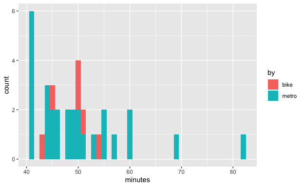
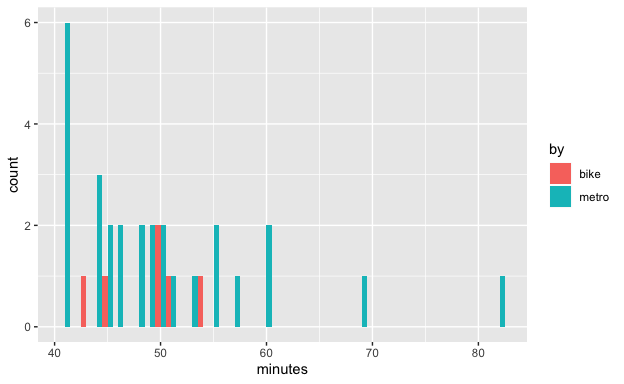
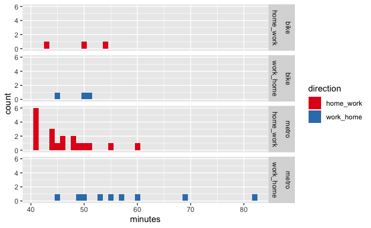
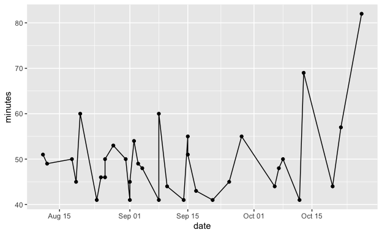

Example: Commute data set
================

## Introduction

Let’s explore a little data set from my life. I wanted to know how long
it really takes me to get to work / home. So I tracked the minutes it
took me to commute (door to door).

1)  Start RStudio.

2)  Create a new project (File → New Project… → New Directory → New
    Project).

3)  Begin a new R Notebook (File → New File → R Notebook) and save it in
    the same folder where you saved your new project.

4)  Download my data set in form of [this csv
    file](https://github.com/anselmrothe/ggplot/blob/master/data/commute.csv)
    (click on ‘Raw’, then cmd + s to save the file) and save it in the
    same folder.

You can copy the code in the sections below into your R Notebook and
execute it by, for example, pressing cmd + enter (mac) or ctrl + enter
(windows) to execute the current line or selection.

-----

## Activate the package

``` r
library(tidyverse)
```

## Load the data

``` r
dd <- read_csv("commute.csv")
```

Let’s have a look at the data

``` r
dd
```

    ## # A tibble: 34 x 4
    ##    direction date       by    minutes
    ##    <chr>     <date>     <chr>   <dbl>
    ##  1 home_work 2015-08-11 metro      51
    ##  2 home_work 2015-08-12 metro      49
    ##  3 home_work 2015-08-18 metro      50
    ##  4 home_work 2015-08-19 metro      45
    ##  5 home_work 2015-08-20 metro      60
    ##  6 home_work 2015-08-24 metro      41
    ##  7 home_work 2015-08-25 metro      46
    ##  8 home_work 2015-08-26 metro      46
    ##  9 home_work 2015-08-31 bike       50
    ## 10 home_work 2015-09-01 metro      41
    ## # … with 24 more rows

Ok, loading the data worked.

## Plotting

Let’s explore the data set\!

How much time did it take me each day?

``` r
dd %>% ggplot(aes(date, minutes)) + geom_point()
```

<!-- -->

Wait, I didn’t record the time every day and sometimes twice (both
directions). The x-axis should reflect that. We change the type of the
`date` column to ‘Date’.

``` r
dd$date <- as.Date(dd$date)
```

``` r
dd %>% ggplot(aes(date, minutes)) + geom_point()
```

<!-- -->

Much nicer.

What does the distribution of commute times look like? Let’s make a
histogram.

``` r
dd %>% ggplot(aes(minutes)) + geom_histogram()
```

    ## `stat_bin()` using `bins = 30`. Pick better value with `binwidth`.

<!-- -->

We notice the binwidth message. Let’s set the binwidth to 1 minute.

``` r
dd %>% ggplot(aes(minutes)) + geom_histogram(binwidth = 1)
```

<!-- -->

-----

### Am I faster with the train or with the bike?

Train or bike is saved in `by` column. Let’s change the color in the
histogram based on the `by` column.

``` r
dd %>% ggplot(aes(minutes, fill = by)) + geom_histogram(binwidth = 1)
```

<!-- -->

Do you see how the blue-ish bars “bump up” the red bars (e.g., around 50
minutes)? There are two ways to get rid of that.

1)  Put bars next to each
other

<!-- end list -->

``` r
dd %>% ggplot(aes(minutes, fill = by)) + geom_histogram(binwidth = 1, position = "dodge")
```

<!-- --> That’s not
good here because now the blue-ish metro bars are to the right of the
red bike bars, so if we want to say which one is faster we just
introduced a bias in favor of bike (by moving those bars to the left).

2)  Two separate
histograms

<!-- end list -->

``` r
dd %>% ggplot(aes(minutes)) + geom_histogram(binwidth = 1) + facet_grid(~by)
```

<!-- -->

Wow, that is simple\! I really like the `facet_grid` command. Note that
both histograms use the same scales, that makes it good for comparison.

Actually, it would be better, if we had on histogram below the other.
All we have to do is moving `by` to the left and add a dot (otherwise
you will get an error – because the `~` can’t be the last symbol, I
believe).

``` r
dd %>% ggplot(aes(minutes)) + geom_histogram(binwidth = 1) + facet_grid(by~.)
```

<!-- -->

Perfect\!

Summary:

  - There is no clear winner, train and bike seem to be relatively
    similar on average.
  - We see that I have way more records for train than bike commutes.
  - Looking at the spread of the data points, I realize why I often
    hesitate for a moment when I say “I need 45 minutes to work”.
  - Seems like train can’t get faster than 41 minutes but can have
    painful slow outliers.

We can arrive at this informative plot in only two lines:

``` r
dd <- read_csv("commute.csv")
dd %>% ggplot(aes(minutes)) + geom_histogram(binwidth = 1) + facet_grid(by~.)
```

-----

### Do we get different results when splitting by direction?

The `.` becomes
`direction`

``` r
dd %>% ggplot(aes(minutes)) + geom_histogram(binwidth = 1) + facet_grid(by ~ direction)
```

<!-- -->

Interesting. The slow train rides where always from work to home (i.e.,
at night) while the really fast rides where from home to work (i.e.,
morning, ah well more like noon).

All plots stacked vertically as
before?

``` r
dd %>% ggplot(aes(minutes)) + geom_histogram(binwidth = 1) + facet_grid(by + direction ~ .)
```

<!-- -->

I like that. With this layout, I feel so much faster to “see the story”
of these data points.

Let’s help the eye with some
colors.

``` r
dd %>% ggplot(aes(minutes, fill = direction)) + geom_histogram(binwidth = 1) + facet_grid(by + direction ~ .)
```

<!-- -->

Let’s help the eye with some nicer
colors.

``` r
dd %>% ggplot(aes(minutes, fill = direction)) + geom_histogram(binwidth = 1) + facet_grid(by + direction ~ .) +
  scale_fill_brewer(palette = "Set1")
```

<!-- -->

-----

I think it would be okay / reasonable to stop here. For the fun of it
(aka to use ggplot), we can try to squeeze more out of the data set, but
with limited prospects of new insights.

### Is there a trend over time?

Let’s repeat the plot from the beginning

``` r
dd %>% ggplot(aes(date, minutes)) + geom_point()
```

<!-- -->

In this plot I notice two things

1)  I recorded more often during the August–September time.
2)  The extreme cases with a long commute occured in the end of the time
    window.

To visualize \#1 we can just make another histogram.

``` r
dd %>% ggplot(aes(date)) + geom_histogram(binwidth = 14)
```

<!-- -->

I played with the width of the bins, and chose 2 weeks = 14 days. Ok,
seems there was a time when I was most motivated to record my commutes.

To visualize \#2 (and to come back to the original question: is there a
trend over time?), let’s try to add a line.

``` r
dd %>% ggplot(aes(date, minutes)) + geom_point() + geom_line()
```

<!-- -->

Hm, this connected the points with a line (definitely useful in other
cases) but here we want something like an average line.

``` r
dd %>% ggplot(aes(date, minutes)) + geom_point() + geom_smooth()
```

    ## `geom_smooth()` using method = 'loess' and formula 'y ~ x'

<!-- -->

Great\! This suggests that my commuting times where stable until October
and then got really worse. But careful, this line is already an
interpretation of our data. ggplot was actually fitting some local
regression (`loess`) model in the background. If you are a modelling
person you probably have your own model for your data. For now let’s
simplify the fitted line to a correlation (-\> linear regression model,
`lm`).

``` r
dd %>% ggplot(aes(date, minutes)) + geom_point() + geom_smooth(method = lm)
```

Let’s explore the compositional power of ggplot again. Is there the
trend the same for both, bike and train?

Earlier, we used `fill` for the color of the bars, here we use `colour`
(the points and lines have no `fill`
property).

``` r
dd %>% ggplot(aes(date, minutes, colour = by)) + geom_point() + geom_smooth(method = lm)
```

<!-- -->

Small change, big result\!

(But let’s not overinterpret the meaning of these lines for this small
data set.)

I think the gray error bands around the lines are important, but we get
rid of them to keep things clean for this
demonstration.

``` r
dd %>% ggplot(aes(date, minutes, colour = by)) + geom_point() + geom_smooth(method = lm, se = FALSE)
```

<!-- -->

How about additionally splitting the data by `direction`? We could use
the facets, as we did
above.

``` r
dd %>% ggplot(aes(date, minutes, colour = by)) + geom_point() + geom_smooth(method = lm, se = FALSE) + 
  facet_grid(direction~.)
```

<!-- -->

If we want to have only one plot, we could, for each direction,

1)  Give different shapes to the points
2)  Give different styles to the lines
3)  Both

Here we go.

1)  Give different shapes to the points

<!-- end list -->

``` r
dd %>% 
  ggplot(aes(date, minutes, colour = by, shape = direction)) +
  geom_point() +
  geom_smooth(method = lm, se = FALSE)
```

<!-- -->

2)  Give different styles to the lines

<!-- end list -->

``` r
dd %>% 
  ggplot(aes(date, minutes, colour = by, lty = direction)) +
  geom_point() +
  geom_smooth(method = lm, se = FALSE)
```

<!-- -->

3)  Both

<!-- end list -->

``` r
dd %>% 
  ggplot(aes(date, minutes, colour = by, shape = direction, lty = direction)) +
  geom_point() +
  geom_smooth(method = lm, se = FALSE)
```

<!-- -->

Great, ggplot understands that `shape` belongs to the points and `lty`
to the lines.

Hey, it would be nice to have an “empty” point instead of the triangle
for the `work_home` data points. You can find a list of possible symbols
by googling “[ggplot point
shapes](https://www.google.com/search?q=ggplot+point+shapes)”. We add
`scale_shape_manual` which means that we manually define the codes for
all shapes that are used in the plot (here, 2 values, namely 19 (filled
point) and 1 (empty point)).

``` r
dd %>% 
  ggplot(aes(date, minutes, colour = by, shape = direction, lty = direction)) +
  geom_point() +
  geom_smooth(method = lm, se = FALSE) +
  scale_shape_manual(values = c(19, 1))
```

<!-- -->

*Let’s have another workshop sometime where I tell you about reshaping
your data…*

-----
